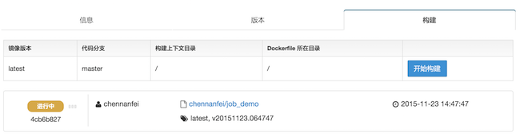
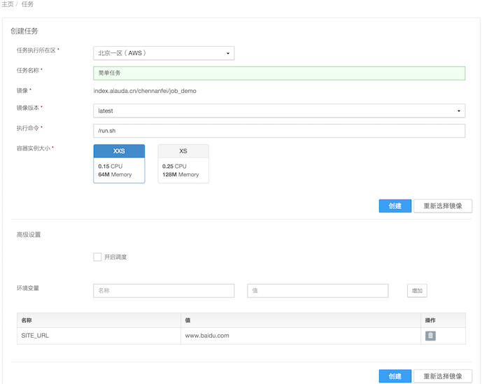
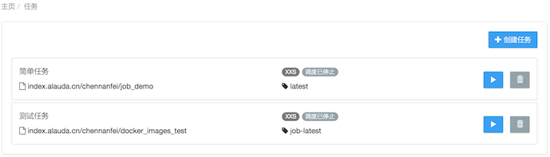

# 任务 #

任务(Job)是Alauda云平台推出基于容器的云端功能，旨在帮助用户执行一次性或重复性的短时作业比如自动化测试，并可以指定运行时参数（环境变量）、执行时间、执行周期和执行次数等。任务与服务（Service）有如下区别：

* 服务是不间断的长时作业比如数据库，而任务是一种短时作业
* 服务运行时，外部能通过网络地址和端口访问服务，而任务运行时是不可访问的
* 任务可以定时即设置开始时间，还可以设置执行周期和执行次数等

任务在执行时，会启动一个容器（container）实例。容器的输出会呈现在任务执行详情页面上。

## 如何创建任务 ##

本章节介绍如何创建任务，让您快速创建一个简单任务。

### 准备镜像 ###

任务也是需要镜像的。如果您已经有镜像，并可以用作任务，可跳过下面的步骤。

如果您不熟悉镜像构建仓库，可以参考[如何创建构建仓库](http://docs.alauda.cn/feature/image-building/create.html)。选择“快速构建”，填上仓库名称（比如job_demo）和代码仓库地址（可以先试试一个非常简单的[代码仓库](https://github.com/mathildetech/job-demo.git)）

创建镜像构建仓库之后，点击“构建”标签页的“开始构建”按钮，等待几分钟至构建完成。

### 创建任务 ###

登陆Alauda云平台，在“任务”标签页面点击“创建任务”按钮，会看到三个标签页面：“我的镜像”、“我的收藏”和“Docker/第三方镜像”。在“我的镜像”和“我的收藏”里选择镜像，或在“第三方镜像”里输入镜像地址。

选择镜像以后，在创建任务页面，输入任务名称（比如“我的任务”）、执行命令，选择镜像版本和资源大小，并可点击“创建”。如果您使用我提供的代码仓库（mathildetech/job-demo）构建的镜像，您还需要提供一个环境变量SITE_URL，其值是任何合法网址例如http://www.baidu.com。

## 任务详情 ##

在任务详情页面，您不仅可以看到该任务的全部信息，还可以进行一系列操作，比如修改任务设置、删除此任务、修改环境变量、开启和设置调度，以及查看任务的执行记录等。

最后，点击“开始执行”！页面会跳转到任务执行详情页面，稍等片刻，就看到任务执行的输出啦！

## 任务调度 ##

调度是Alauda云端任务的一个重要特点。如果您的任务是需要周期性或者在某个特定的时刻执行，建议您在创建任务时或者在任务详情页选择“开启调度”，同时输入任务第一次执行的开始时间、执行间隔和执行次数。

## 任务列表 ##

在任务列表页，您可以看到名下所有的任务，并可通过“创建任务”按钮创建新任务。每项任务都可以进行两项操作：“开始执行”和“删除”。删除时请慎重哦，一旦任务被删除，其执行记录也会被删除。
