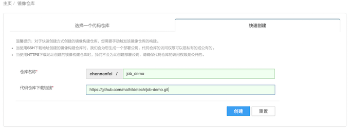
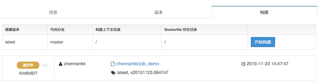
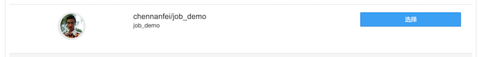
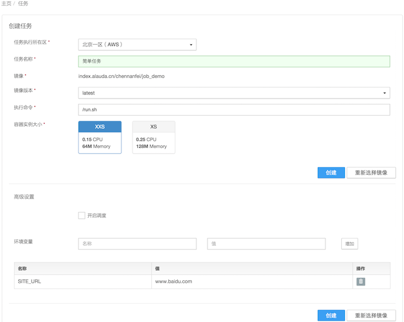

## 如何创建任务 ##

本章节介绍如何创建任务，让您快速创建一个简单任务。

### 准备镜像 ###

任务也是需要镜像的。如果您已经有镜像，并可以用作任务，可跳过下面的步骤。

如果您不熟悉镜像构建仓库，可以参考[如何创建构建仓库](http://docs.alauda.cn/feature/image-building/create.html)。选择“快速构建”，填上仓库名称（比如job_demo）和代码仓库地址（可以先试试一个非常简单的[代码仓库](https://github.com/mathildetech/job-demo.git)）

创建镜像构建仓库之后，点击“构建”标签页的“开始构建”按钮，等待几分钟至构建完成。

### 创建任务 ###

登陆Alauda云平台，在“任务”标签页面点击“创建任务”按钮，会看到三个标签页面：“我的镜像”、“我的收藏”和“Docker/第三方镜像”。在“我的镜像”和“我的收藏”里选择镜像，或在“第三方镜像”里输入镜像地址。

选择镜像以后，在创建任务页面，输入任务名称（比如“我的任务”）、执行命令，选择镜像版本和资源大小，并可点击“创建”。如果您使用我提供的代码仓库（mathildetech/job-demo）构建的镜像，您还需要提供一个环境变量SITE_URL，其值是任何合法网址例如[www.alauda.cn](http://www.alauda.cn)

