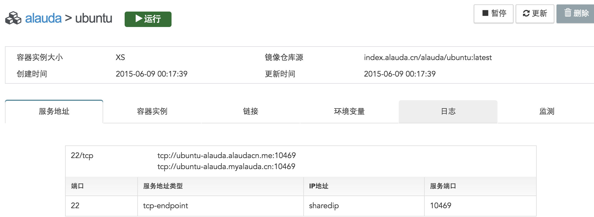
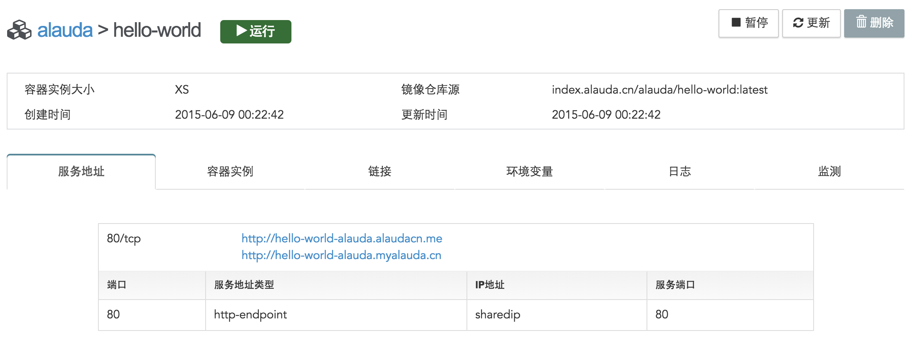
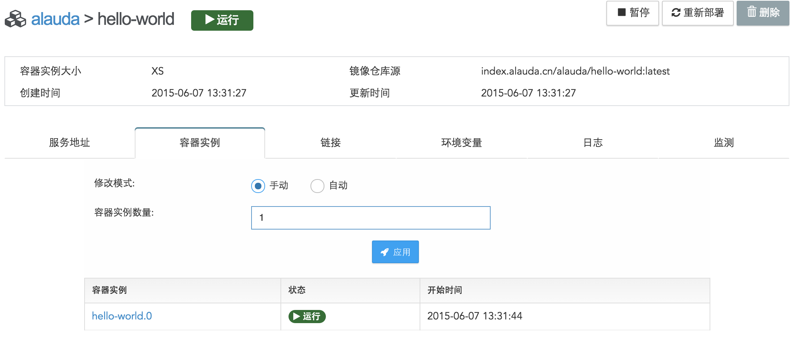
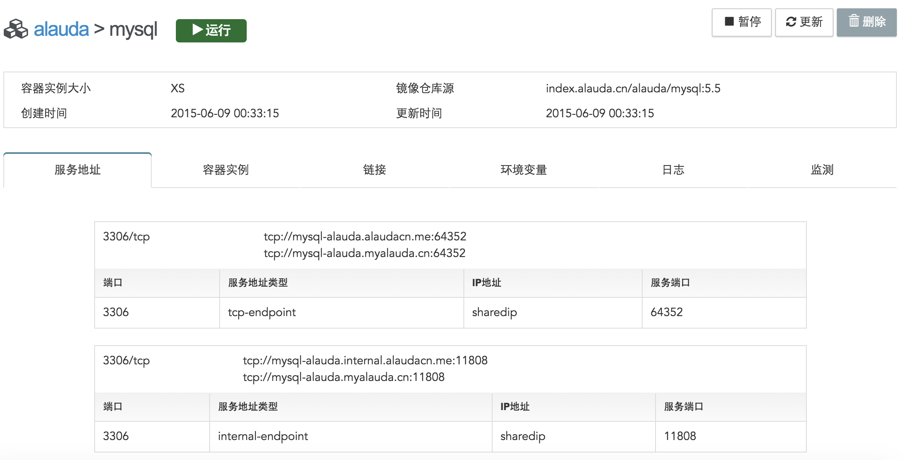

## 网络设置

创建服务时可以对服务进行网络设置，包括“用户域名”和“端口映射”。下面将分别介绍：

### 用户域名

服务被创建后，默认情况下，alauda云平台会自动为该服务生成一个域名：<servicename>-<username>.alaudacn.me。用户可以通过该域名来访问该服务。但是用户也可以为自己的服务设置一个自定义的域名，并且使用这个自定义的域名来访问服务。

需要注意的是：只有在该服务拥有一个http-endpoint的端口映射类型时，才能设置用户域名，关于端口映射类型，请参考后面的段落。同时为了能够顺利访问用户自定义的域名，用户需要到域名服务商处给这个域名添加一个指向服务默认域名的CNAME记录，同时用户域名需要用户自己按照国家有关规定进行备案。

例如，用户tom使用镜像alauda/hello-world创建了一个名为hello的服务，系统给该服务默认生成的域名是hello-world-tom.alaudacn.me。假设用户在某个域名服务商处申请了一个www.tom.cn的域名，并希望可以通过www.tom.cn访问这个hello服务。那么可以在“用户域名”处填入“www.tom.cn”。同时在域名服务商处给www.tom.cn添加一个指向hello-world-tom.myalauda.cn的CNAME记录。这样无论是访问`http://www.tom.cn` 还是访问 `http://hello-world-tom.alaudacn.me`， 都能够访问到这个hello-world服务。

### 端口映射和服务地址

一个服务可以暴露多个端口，在alauda平台上启动服务的时候，会为每一个需要暴露的端口映射出一个可以供用户访问的服务端口（Service Port），用户可以通过服务的域名以及服务端口来访问该服务。域名加端口就是一个服务地址（Endpoint）。目前对于同一个端口，最多有四种映射方式，因此最多有四种类型的服务地址，他们分别是：tcp-endpoint、http-endpoint、direct-endpoint和internal-endpoint。一个服务的每个端口可以设置这四种类型中的任意一种或者多种。

默认情况下，如果一个服务内部暴露的端口是80/tcp，那么在用户创建服务的时候，alauda云平台会给该端口自动添加一个http-endpoint。如果一个服务内部暴露的端口不是80/tcp的，那么会自动添加一个tcp-endpoint。用户可以根据自己的需求，来对服务的endpoint类型进行添加和删除。但是需要注意的是：一个服务所有端口的配置中，最多只能包含一个http-endpoint，而且同一个端口的同一种类型的服务地址只能有一个。

下面将会对这四种访问类型的含义和应用场景进行详细的介绍：

1. tcp-endpoint（External Load-balanced TCP Endpoint）
   是指这种服务地址可以被用户直接访问，alauda云平台为这个服务自动添加一个负载均衡器（Load Balancer），并且这种服务通过TCP的方式访问。 这种服务地址类型主要用于访问服务镜像里需要暴露出来的TCP端口。使用该类型创建的服务地址中的服务端口是随机分配的，一般是一个大于10000小于65535的整数。如下图，给一个ubuntu服务的22端口设置一个tcp-endpoint：
   
   服务创建成功后，在服务详情页可以看到该服务的22端口可以通过ubuntu-alauda.myalauda.cn:10469和ubuntu-alauda.alaudacn.me:10469使用TCP协议访问。
   
2. http-endpoint（External Load-balanced HTTP Endpoint）
   是指这种服务地址可以被用户直接访问，alauda云平台为这个服务自动添加一个负载均衡器（Load Balancer），并且这种服务通过HTTP的方式访问。这种服务地址类型主要用于访问服务镜像里需要暴露出来的HTTP端口（如80端口以及某些镜像中的8080端口等）。使用该类型创建的服务地址中的服务端口是80。如下图，alauda官方镜像中得hello-world镜像暴露的就是80端口，当用户要创建一个hello-world服务的时候，alauda会自动添加一个http-endpoint类型的访问方式。
   
   服务创建成功后，在服务详情页可以看到http-endpoint的服务地址是以链接的方式显示（如下图），用户可以直接点击链接访问服务。
   
3. direct-endpoint（External Direct TCP Endpoint）
   上面两个服务地址都是服务（Service）的服务地址，而direct-endpoint是服务中的实例（Instance）的服务地址。如果一个服务的一个端口设置了direct-endpoint类型，那么这个服务的每一个实例的该端口都会拥有一个可以外部访问的服务地址，这样用户就可以通过访问这个服务地址来访问指定的实例，每一个实例的服务地址可以在“容器实例”选项卡处看到。direct-endpoint中的服务端口都是随机生成的。
   如下图，创建alauda/hello-world的服务，并给该服务的80端口增加一个direct-endpoint类型：
   
   那么在服务的详细信息页里，点击“容器实例”，查看到实例列表，如下图：
   
   进入hello-world.0实例如下所示，就可以根据提供的URL和端口对这个实例进行访问。
   
   如果一个服务只有一个实例，那么访问该服务的tcp-endpoint或http-endpoint地址和访问该实例的direct-endpoint地址的效果是一样的，都是访问这个唯一的实例。
4. internal-endpoint（Internal Load-balanced TCP Endpoint）
   以上三种类型的服务地址都是可以被用户直接访问到的，而internal-endpoint只能在alauda云平台内部被访问。alauda云平台为这类服务的指定端口添加一个只能内部访问的负载均衡器（Load Balancer）以及一个内部域名，其格式为<servicename>-<username>.internal.myalauda.cn（见下图）。当有别的服务链接（link）这个服务时，链接服务就可以通过该内部域名访问这个被链接的服务，而其它服务或实例都无法访问这个地址。例如一个mysql的服务只设置了internal-endpoint，当用户创建一个web服务链接到mysql服务时，这个web服务就可以通过mysql-username.internal.alaudacn.me:service_port访问mysql，而该用户的其它服务或实例以及其它用户的所有服务和实例都无法访问这个mysql。
   
 

