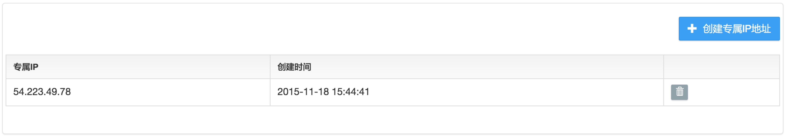
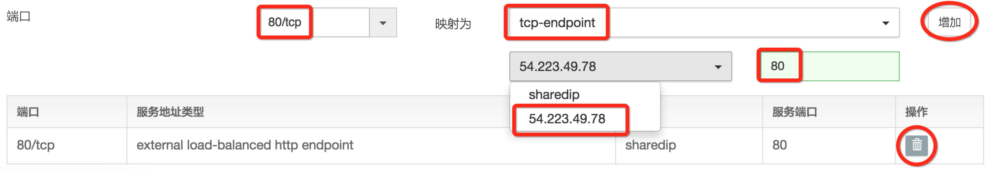
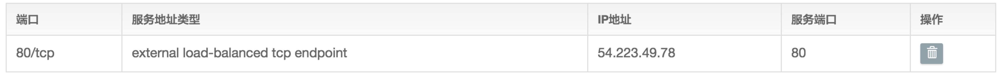
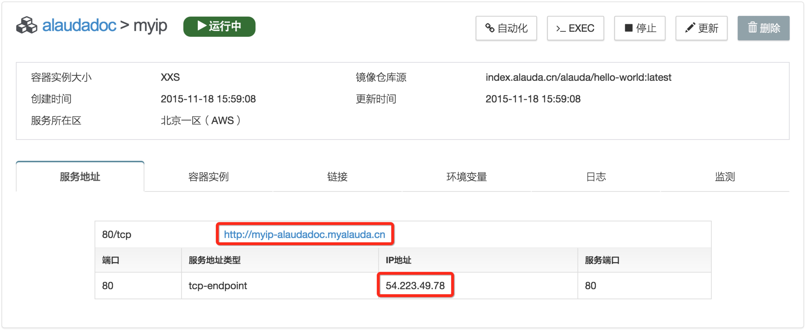

# 专属IP与泛域名解析

## 专属IP

专属IP是灵雀云为用户提供的一个高级功能。一个专属IP是一个可以外部访问的固定IP地址，目前只支持（AWS区）。如果用户有为自己的服务使用一个独立的IP地址的需求，那么可以使用专属IP这个功能。

首先您需要开通专属IP的功能，如果您还不能使用专属IP的功能，请提交工单申请。当您拥有专属IP的功能后，可以点击“专属IP”菜单，然后点击中间的“创建专属IP地址”。

稍等片刻之后，就可以看到您当前拥有的所有专属IP地址的列表。

现在创建一个hello-world服务。在服务配置页面上，删掉原来默认添加的http-endpoint。重新添加一个新的tcp-endpoint。新的服务地址必须是tcp-endpoint，并且要选择一个自己已经拥有的专属IP地址，ip地址后面的输入框里输入该“80/tcp”的服务端口，由于专属IP上的端口完全由用户个人管理，所以可以填写任何一个可用的端口，这里我们输入“80”。需要说明的是，由于一个服务不能既使用共享IP，又使用专属IP。所以添加专属IP的tcp-endpoint之前，必须删除原来默认的endpoint。

最终配置好的服务端口如下图所示：

当使用专属IP地址创建服务时，不需要用户设置“用户域名”。

完成服务创建后，从服务详细信息页面可以看到，灵雀云仍然给该服务分配了一个默认域名，只是这个域名绑定的IP地址是用户的专属IP地址。

## 泛域名解析

灵雀云默认不支持泛域名解析，只支持给某个服务一个确定的域名（见3.3.2）。但有时候当我们需要为某个服务设置泛域名解析的时候，就必须使用灵雀云提供的专属IP功能。我们只需要在把服务创建起来后，在用户自己的域名服务商处，添加一条A记录，将域名（如 *.test.com）指向这个专属IP地址即可。

