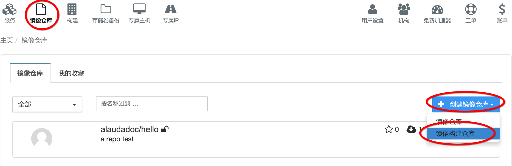
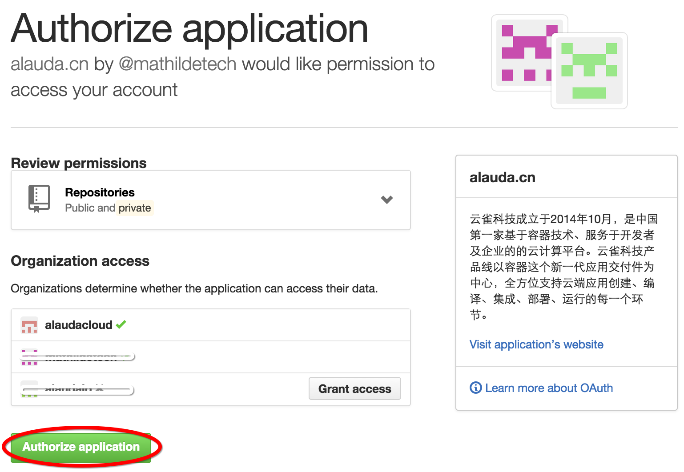
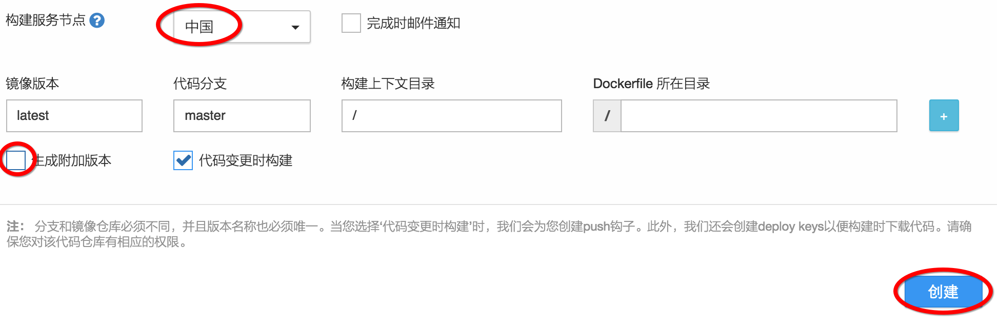

# 第八章　第一个属于自己的镜像　从代码自动构建镜像

在上一章，我们创建的镜像仓库虽然可以pull或push镜像，但这些都需要手动来操作。在实际中，更多的是我们希望能够从代码仓库中自动生成镜像，这样会更加方便实用。在本章您将学习灵雀云是如何为用户提供这个强大的功能的。

## 创建代码仓库

首先您需要有一个代码仓库，目前灵雀云支持github和bitbucket，我们在教程中使用github做示例，bitbucket的操作是类似的。如果您还没有github账号，请先注册账号。

登录github，然后创建一个“tutorial-autobuild-myhello”代码仓库。接着打开本地的命令行窗口，为代码仓库添加以下内容：

		git clone https://github.com/alaudacloud/tutorial-autobuild-myhello.git
		cd tutorial-autobuild-myhello
		touch server.js
		touch Dockerfile

我们为这个代码仓库增加了两个文件：server.js和Dockerfile。其中server.js的内容是：

		var http = require("http");
		var os = require("os");
		http.createServer(function(request, response) {
		    console.log("New request arrived.");
		    response.writeHead(200, {"Content-Type": "text/plain"});
		    response.write("Hi, you are visiting " + os.hostname() + "\n");
		    response.end();
		}).listen(8080);
		console.log("Server is running, listening on port 8080....");

这个代码和第六章的代码是一样的。而Dockerfile内容是：

		FROM ubuntu:trusty
		MAINTAINER alaudadoc alaudadoc@alauda.cn

		RUN apt-get update && apt-get install -y nodejs
		EXPOSE 8080
		COPY server.js /
		CMD ["nodejs", "/server.js"]

这是一个非常简单的dockerfile，其功能就是在容器中安装nodejs环境，并把上面的server.js代码运行起来，同时声明外部可以访问8080端口，下面我们提交代码：

		git add .
		git commit -m "add my code"
		git push -u origin master

代码提交后，我们可以看到bitbucket的代码仓库中已经有了我们刚增加的Dockerfile和server.js。

## 创建镜像构建仓库

有了代码仓库后，我们现在创建镜像构建仓库。镜像构建仓库本质上是一个镜像仓库，但是它里面的镜像不是通过用户手工推送(push)上来的，而是通过灵雀云的自动构建功能自动推送进来的，因此这种仓库不支持手工推送。

点击控制台上方菜单“镜像仓库”进入镜像仓库列表，可以看到我们之前创建的“alaudadoc/hello”，点击右侧的“+创建镜像仓库”，选择“镜像构建仓库”。

在代码仓库选择列表中选择“关联GitHub”，这时页面可能会要求您的代码仓库对灵雀云授权。

授权通过后，您的代码git账号中的所有代码仓库都会在页面上列出来，选择“alaudacloud/tutorial-autobuild-myhello”，点击“选择”按钮进入配置页面。

在配置页面中，一些必要的参数已经填好了，我们只需要填写“简要描述”。对于本章的示例，我们还需要手工修改两个配置：“服务构建节点”请选择“中国”，“生成附加版本”请去掉勾选。然后点击创建。

创建完成后
