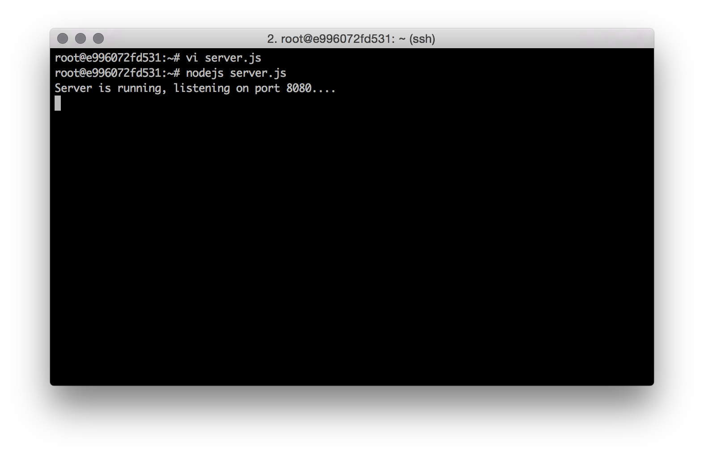
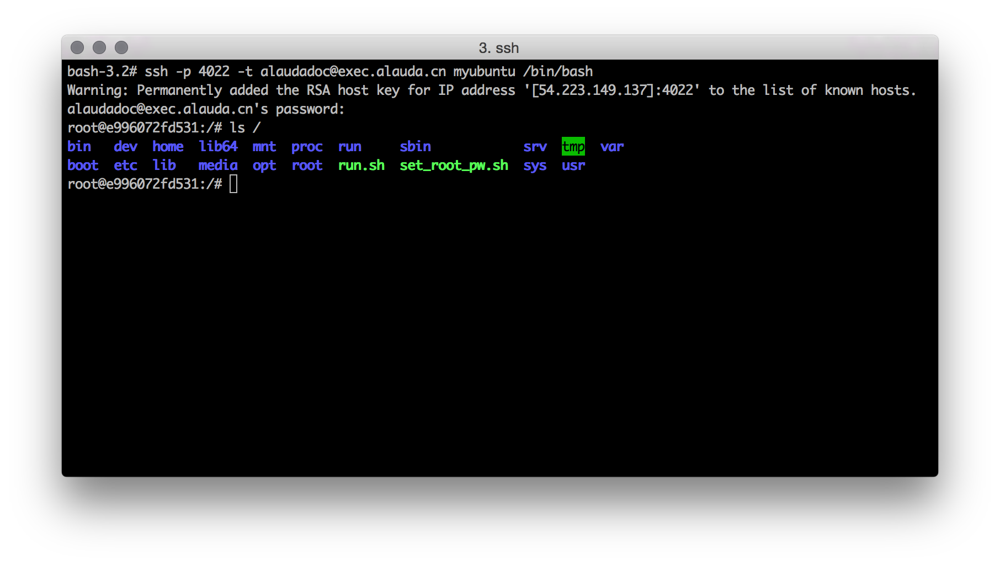
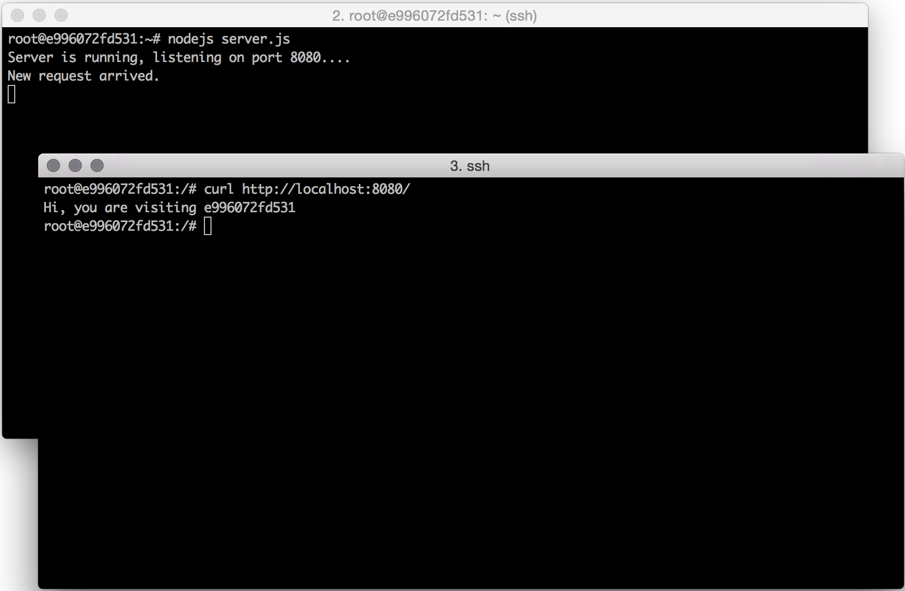
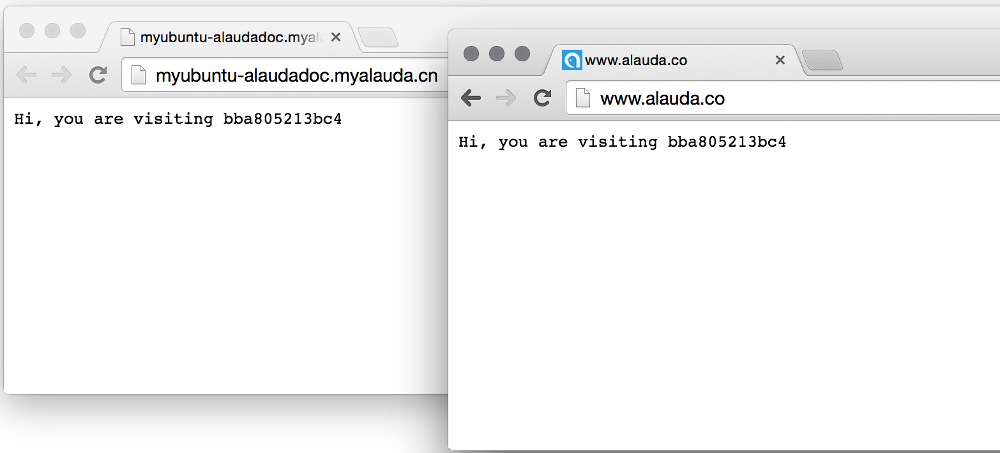

# 第六章　加入自己的代码　开发与调试

我们已经学会了如何创建最基本的服务，但到目前为止，这些服务中还没有包含我们自己的代码，这显示是不能满足大家的需求的。本章，我们将告诉大家一种最方便地加入自己代码并进行简单调试的方法。

为了演示方便，我们先将上一章创建的myubuntu的容器实例数量改为“1”。然后登录这个服务，并输入下列命令安装我们需要的软件环境：

		# apt-get update
		# apt-get install -y nodejs curl		

然后我们使用vi创建一个server.js的文件，内容如下：

		var http = require("http");
		var os = require("os");
		http.createServer(function(request, response) {
		    console.log("New request arrived.");
		    response.writeHead(200, {"Content-Type": "text/plain"});
		    response.write("Hi, you are visiting " + os.hostname() + "\n");
		    response.end();
		}).listen(8080);
		console.log("Server is running, listening on port 8080....");

保存文件，并退出vi回到命令行，然后运行我们的程序：

		# nodejs server.js

我们看到程序将会一直运行，等待http访问。现在我们在ubuntu这个容器里测试一下我们的程序是否运行的正确。由于这个server.js的程序一直在前台运行（除非我们通过Ctrl+C强行停止），我们没法回到命令行去输入更多的命令。所以我们只有两个办法：让这个程序在后台运行或者新开一个终端再次ssh到ubuntu里来。第二种办法在调试的时候比较方便，但它有个局限，那就是对于不支持sshd服务的镜像来说，这种方法就不能用了。好在灵雀云为我们提供了强大的exec功能。我们接下来将通过这个功能连接到这个容器的内部。

让我们打开一个新的终端，然后敲入下面的命令：

		# ssh -p 4022 -t alaudadoc@exec.alauda.cn myubuntu /bin/bash

当然这里的`alaudadoc`需要换成你的用户名。敲入回车键后，提示输入密码。注意，这个密码是你的灵雀云账号的密码，而不是ubuntu的root密码。输入完密码回车，你会发现，你已经登录到了这个容器的内部，你所看到的和SSH到这个ubuntu容器的效果是一样的。

我们在这个终端去访问我们刚刚运行的web服务：

	# curl http://localhost:8080/

我们可以看到返回类似`Hi, you are visiting e996072fd531`的信息，这表示我们的程序运行正常。而运行程序的窗口也能看到这次请求打印出来的信息。

这样，一个包含有我们自己程序的服务就已经运行起来了。由于在上一章，我们已经将8080端口映射为一个http-endpoint，即80端口，于是你可以在浏览器访问：`http://myubuntu-alaudadoc.myalauda.cn/`，同时如果上一章你的“用户域名”设置的正确的话，那么你就可以通过`http://www.alauda.co/`来访问你的服务了。

### 常见问题

* 为什么我在ubuntu容器里不能使用vim等命令？
  tutum/ubuntu的镜像只包含最基本的ubuntu环境，很多命令都需要用户自己安装，所以如果您想使用vim，请先通过apt-get install来安装vim。

